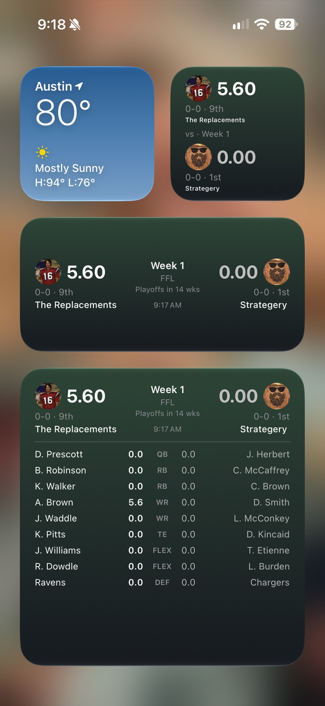
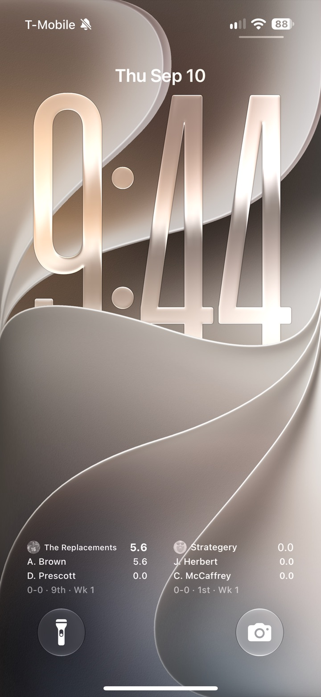

# Sleeper Companion

[](https://github.com/AustinWinstanley/sleeper-companion/actions/workflows/ci.yml)

iOS Home Screen and Lock Screen widgets for your [Sleeper](https://sleeper.com) fantasy football matchup: live-ish scores, records and rank, starting lineups, and a one-tap jump into the Sleeper app.

An unofficial personal project, built for one league's group of friends. Not affiliated with Sleeper. See the [disclaimer](#disclaimer) below.

<p align="center">
  
  &nbsp;&nbsp;&nbsp;
  
</p>

## What it does

- **Setup in one step.** Type your Sleeper username, confirm the account, done. No login, no password, no server.
- **Home Screen widgets** in small, medium, large and the iOS 27 full-page size: score vs opponent with the leader in bold, record and league rank, week, and a playoff countdown that becomes the bracket round once playoffs start.
- **Game-day detail**: how many starters each side still has to play, a projected final score, and a warning when your lineup has an empty, bye-week or ruled-out starter.
- **Lineups** in the large sizes: both starting lineups slot by slot, with projections before kickoff, live points after, injury and bye flags, and finished games dimmed. The full-page size adds league standings, your playoff path and the latest roster move.
- **Lock Screen widgets**: a matchup summary, a score-share gauge, an inline line above the clock, and a **Team Panel** you place twice (yours and your opponent's) to use the whole row. iOS has no full-width Lock Screen widget, so this is how you get one.
- **Multiple leagues.** Long-press any widget to pick the league. With one league there is nothing to choose.
- **Tap to open Sleeper.** Any widget hands off to the Sleeper app.
- **Degrades gracefully.** The last good scores are cached and shown marked "Cached" when a refresh fails.

## How it's built

SwiftUI + WidgetKit + AppIntents, iOS 17+, no third-party dependencies. About 2,700 lines of Swift.

- `App/` is the app: username setup, a live preview of every widget layout, league selection.
- `Widget/` is the extension: two widget kinds, each configured through an `AppIntent` whose league options come from the Sleeper API and are cached for offline resolution.
- `Shared/` compiles into both targets: a small typed client for Sleeper's public REST API, the matchup logic (pairing rosters by `matchup_id`, standings from wins then points-for, lineups aligned to the league's roster slots), App Group + iCloud key-value storage, the cache, and the SwiftUI layouts.

A few decisions worth calling out:

- **Player names without blowing the widget memory budget.** Sleeper's player list is ~15 MB. Only the app downloads it, at most once a day, and writes a ~200 KB id-to-name map into the App Group. Widgets read that. Until the app has run once, lineups show slot labels instead of names.
- **One fetch path for everything.** All widget kinds and the in-app preview go through the same loader, so a Home Screen widget, two Lock Screen panels and the app share a cached snapshot rather than multiplying API calls.
- **Refresh follows the NFL schedule.** iOS gives a widget a limited number of refreshes per day. The widget asks for one every 15 minutes while games are live, a little slower on a game day before kickoff, and every couple of hours otherwise, and it labels stale data rather than pretending to be live. A true live view would be a Live Activity fed by push, which needs a server and is out of scope.
- **Everything beyond the core matchup is optional.** Schedule, projections and injuries come from endpoints Sleeper's own apps use but its API docs don't list, so they may change without notice. Each is fetched best-effort, and when one is missing that part of the widget is simply left out. Projections are cached for a few hours and fetched one position at a time to stay inside a widget's memory budget.
- **Accented rendering.** With Tinted or Clear icon styles iOS strips widget backgrounds and repaints in one tint. Scores and headers are marked accentable and avatars opt back into full color, so the widget reads well in every style.
- **No hardcoded IDs.** The only per-fork values are the bundle ID and team ID in `project.yml`; App Group, iCloud and URL scheme identifiers derive from them at build and run time.

## Build it

Requires Xcode 16+ and [XcodeGen](https://github.com/yonaskolb/XcodeGen) (`brew install xcodegen`).

```bash
xcodegen generate
open SleeperCompanion.xcodeproj
```

Unit tests cover the matchup logic (opponent pairing, byes, co-owners, standings, lineup alignment), game status and projections, injury flags, refresh pacing, the playoff bracket and model decoding, all against canned API payloads. Run them with ⌘U or:

```bash
xcodebuild test -project SleeperCompanion.xcodeproj -scheme SleeperCompanion -destination 'platform=iOS Simulator,name=iPhone 16'
```

CI runs the same on every push.

To run on your own devices, change `APP_BUNDLE_ID` and `DEVELOPMENT_TEAM` at the top of `project.yml`. Signing is automatic. Distribution to friends is via TestFlight external testing; builds expire after 90 days, so bump `CURRENT_PROJECT_VERSION` and re-upload a couple of times a season.

## Ideas

Things that would be fun to add. Most wait on data the public API doesn't expose, which is part of why they're interesting.

- **Win probability** next to the projected score. Projections are per player; turning them into odds needs a game clock, which the API doesn't expose.
- **A Live Activity during game windows**: full width on the Lock Screen and in the Dynamic Island, fed by push so it stays current instead of waiting on the widget refresh budget.
- **Deep link straight to the matchup.** Sleeper's universal links cover chat, so a widget tap currently lands on the app's home screen.
- **Player headshots** in the lineup views.
- **Kickoff-aware refresh.** The schedule has dates but no kickoff times, so game days are treated as live all day.
- **Flip leagues from the widget** with an interactive button instead of the configuration sheet.

## Disclaimer

This project is not made, endorsed or supported by Sleeper (Blitz Studios, Inc.). "Sleeper" is a trademark of its owner and is used here only to describe what the app connects to; the icon and all artwork in this repository are original. The app only reads unauthenticated Sleeper endpoints (the documented public API plus a few undocumented read-only ones for schedule and projections), never handles Sleeper credentials, and is distributed privately to a handful of friends. It will not be published to the App Store. If you are the rights holder and want anything changed or removed, open an issue and it will be handled promptly.
